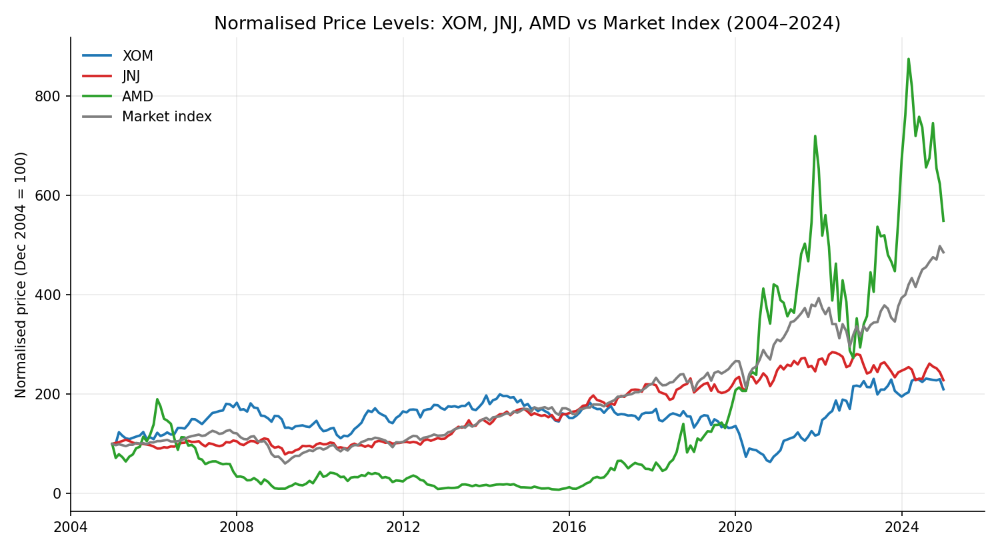

# 📈 Optimal Portfolio Construction & Risk-Return Analysis

A group project analysing 20 years of monthly data (2004 to 2024) for Exxon Mobil, Johnson & Johnson and AMD against a market index, and building the optimal risky portfolio from first principles.

**Key results**

- Optimal portfolio (23% XOM, 46% JNJ, 30% AMD) improved the Sharpe ratio by 12% over the best individual stock (0.1303 vs 0.1166)
- Positive CAPM alpha (0.0015) with beta of 1.10 against the market
- Allowing short selling and leverage changed nothing: the tangency portfolio was already long-only
- AMD: highest return (448.55% holding period return) and highest risk (16.90% monthly volatility)

📄 **Full analysis, figures and results:** [Optimal_Portfolio_Report.pdf](Optimal_Portfolio_Report.pdf)

## Why this project

This was my chance to take the portfolio theory I had been studying and actually build it end to end: not just calculating a Sharpe ratio in isolation, but going from raw prices all the way to an optimised portfolio and a verdict on whether it beat the market. What hooked me was seeing diversification work mechanically. Three stocks, none of them improved individually, combined into something with better risk-adjusted returns than any of them alone, purely because of how their movements offset each other. I also did not expect that allowing short selling and leverage would change nothing; the optimal portfolio was already long-only, which taught me to check whether constraints actually bind before assuming they matter.

## Method

We computed arithmetic and geometric returns, volatilities and Sharpe ratios for each asset, built the covariance and correlation matrices, then used Excel Solver to find the weights maximising the Sharpe ratio, with and without short-selling constraints. We combined the optimal risky portfolio with the risk-free asset along the Capital Allocation Line, and finally regressed portfolio returns against the market to estimate alpha (0.0015) and beta (1.0998).

## Skills used

- **Portfolio construction and optimisation**: mean-variance analysis, tangency portfolio, constrained optimisation with Solver
- **Risk measurement**: volatility, Sharpe ratios, covariance and correlation analysis, diversification effects
- **Performance evaluation**: CAPM regression, alpha and beta interpretation, benchmarking against an index
- **Advanced Excel**: financial modelling, Solver, regression tooling
- **Communication**: translating quantitative results into clear recommendations in a structured report, as part of a team

These are the same techniques used daily in portfolio analytics, investment risk and multi-asset teams, applied to real market data rather than a textbook example.

## 🙏 Acknowledgments

Completed as a group project (Team Alpha) for an Investments module at Nanyang Technological University. All members contributed to the analysis and report; full references are in the [report bibliography](Optimal_Portfolio_Report.pdf).
